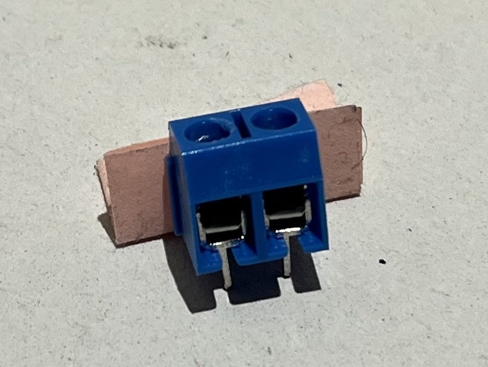

# Puff Battery Cell Recharger
## Recharge The garbage! Regharge!
This progect aims to recharge lithium batteries from PUFF e-cigrettes and any other kind of disposable vapes.
No code is involved in the project but just a couple of .stl files and some photos to replicate what i did.

This kind of cells are rechargeable hundreds of times despite their limited capacity so they can be used for small electronic projects and for IoT devices.
With this device I hope to help other people find a way to easily recharge them.

## Images
  

## Components
- Old power bank to salvage the recharging chip from 
- A 3d printer of any sort
- Basic soldering skills
- Two thin wires (e.g. broken led pins halved are fine)
- Double pin socket from an arduino kit
    

## Guide

### 1st step: Gathering the chip
Disassemble the powerbank exposing it's chip.
 
 With the soldering iron gently touch the cables leading to the battery in the connecting point to unsolder them.

### 2nd step: Design the enclosure
Design and print the enclosure for the device. If you have the same components as me you can download the .stl files from the Models folder.
Iused a Elegoo Saturn resin printer
Remember to scale the prints of about 6-7% to give the sufficient tolerance to fit everything. e.g. printing the models at 107% scaled size should be fine
  
 

### 3rd step: Solder the circuit
The circuit is pretty simple, it's just the connector soldered to the chip with two thin wires.
  
  

### 4th step: Assembly
Position the circuit inside the 3d models that should fit together. To join them you can use some tape, some glue or some resin.
Before joining them remember to try the circuit with a discharged power cell
  

### 5th step: Use the device
You can use directly the wires of a battery or if the battery doesn't have wires you can use two jumper wires.
 
 ATTENTION! use only batteries with the proper voltage (e.g. 3.7V and 500mah)

## Documentation
These are the videos that inspired me for this project. 
 Disassembly: 
 https://www.youtube.com/watch?v=ukvT_RBx-4U
 
 Actual tutorial: 
 https://www.youtube.com/watch?v=M88e1r8nvYk
 
 Basic idea: 
 https://www.youtube.com/shorts/beWTIUarKYY
 https://www.youtube.com/watch?v=rG7qLbuWvK8&t=647s
 
 Example of recharge in the wrong way: 
 https://www.youtube.com/watch?v=MG47qHrulyI
 https://www.youtube.com/watch?v=NkLQbNGd8ro&t=58s
