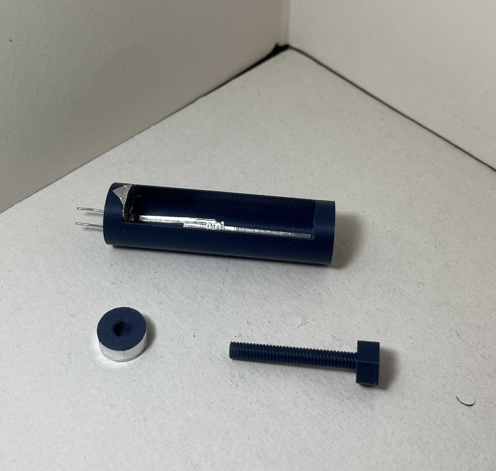

# Puff Battery Cell Recharger
## Recharge The garbage! Regharge!
This progect aims to recharge lithium batteries from PUFF e-cigrettes and any other kind of disposable vapes.
No code is involved in the project but just a couple of .stl files and some photos to replicate what i did.

This kind of cells are rechargeable hundreds of times despite their limited capacity so they can be used for small electronic projects and for IoT devices.
With this device I hope to help other people find a way to easily recharge them.

### Edit [10 sept 2024]
I posted an addendum device which helps to recharge batteries of various length in an easy way without using the dangerous flying wires which can short easily. Scroll down to see it!

## Images
  

## Components
- Old power bank to salvage the recharging chip from 
- A 3d printer of any sort
- Basic soldering skills
- Two thin wires (e.g. broken led pins halved are fine)
- Double pin socket from an arduino kit
    

## Guide

### 1st step: Gathering the chip
Disassemble the powerbank exposing it's chip.
 
 With the soldering iron gently touch the cables leading to the battery in the connecting point to unsolder them.

### 2nd step: Design the enclosure
Design and print the enclosure for the device. If you have the same components as me you can download the .stl files from the Models folder.
Iused a Elegoo Saturn resin printer
Remember to scale the prints of about 6-7% to give the sufficient tolerance to fit everything. e.g. printing the models at 107% scaled size should be fine
  
 

### 3rd step: Solder the circuit
The circuit is pretty simple, it's just the connector soldered to the chip with two thin wires.
  
  

### 4th step: Assembly
Position the circuit inside the 3d models that should fit together. To join them you can use some tape, some glue or some resin.
Before joining them remember to try the circuit with a discharged power cell
  

### 5th step: Use the device
You can use directly the wires of a battery or if the battery doesn't have wires you can use two jumper wires.
 
 ATTENTION! use only batteries with the proper voltage (e.g. 3.7V and 500mah)

## Addendum
Because I recently developed a project which requires the use of these repurposed batteries, I needed to be able to recharge them easily and reliably. The problem was that the "flying" cables of the cells are so thin that the socket strubbles to hold them in place, causing unwanted disconnections and decreasing security of use.
So I designed an enclosure easy to print, but still in developement. Indeed to make it work, some presicion work must be done, I don't like it because it's not easily reproducible but still it works for now.

 
 
As you can see the appearence is similar to a syringe, the assembly is described below:

### Components
 
 We have three printed components and requires two additional items:

#### Printed
<li> Body. The body has two small holes on one ending, which will hold the metal pins, a threaded hole on the other ending to screw the bolt in, and a carved cylinder hole along the lenght to hold the power cell
<li> Nut. The nut is a simple cylinder with a threaded hole.
<li> Bolt. It's the device that will allow us to "squeeze" and hold stil the cell once is put in the enclosure.

#### Not Printed

<li> Conductive tape. It's aluminum tape which is conductive, and can be cutted precisely to obtain a desired shape and therefore almost any condutive piece that we like.
<li> Jumper wire. the pins of the jumper wire have to be inserted in the two holes of the body, and connected to the conductive tape.

### Procedure
<li>Cut the pins form the jumper wire and put them in the designed holes. Be sure to remember which pin you want to be the positive and the negative.
<li>then we have to cover the nut with the conductive foil.
<li>Then we cut a circle out of the foil and stick it to the inner base of the carved cylinder in the printed body. the same face the two holes are on. This conductive circle must be connected to the positive pin.
<li>Then we cut a thin line of conductive tape and stick it along the carved cylinder connecting it to the negative pin.
<li>After that a wider piece of conductive tape can be attached to the bottom part of the carved cylinder in order later to put in contact the foiled nut to the negative pin.

### Assembly
Just drive the bolt in the body threaded hole and then in the nut. You should end up with a similar result to this:
 
 

### Use
The following gif demonstrates how the cell should me mounted and how the enclosure should be plugged in the recharger. The reason for the paper stripe that I put at the beginning is for easily remove the cell later, not for isolation purposes. It's just convenience but everithing works also without the paper piece
 

## Documentation
These are the videos that inspired me for this project. 
 Disassembly: 
 https://www.youtube.com/watch?v=ukvT_RBx-4U
 
 Actual tutorial: 
 https://www.youtube.com/watch?v=M88e1r8nvYk
 
 Basic idea: 
 https://www.youtube.com/shorts/beWTIUarKYY
 https://www.youtube.com/watch?v=rG7qLbuWvK8&t=647s
 
 Example of recharge in the wrong way: 
 https://www.youtube.com/watch?v=MG47qHrulyI
 https://www.youtube.com/watch?v=NkLQbNGd8ro&t=58s
